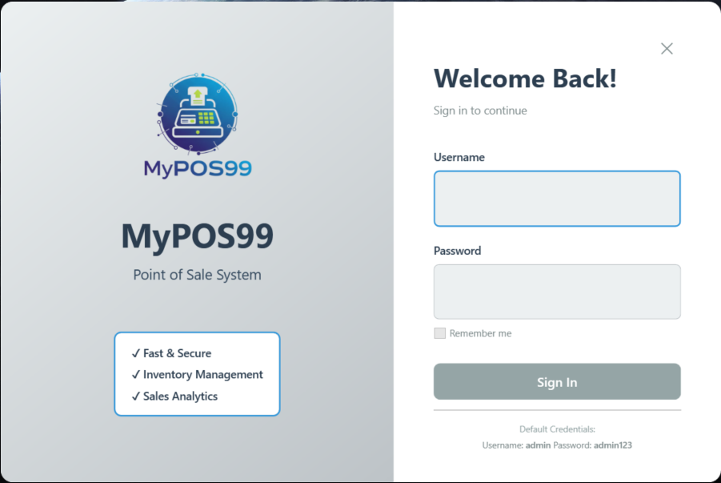
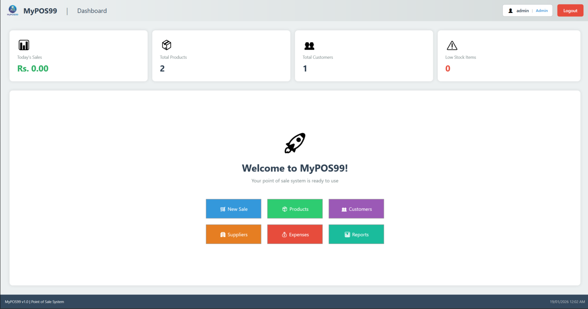
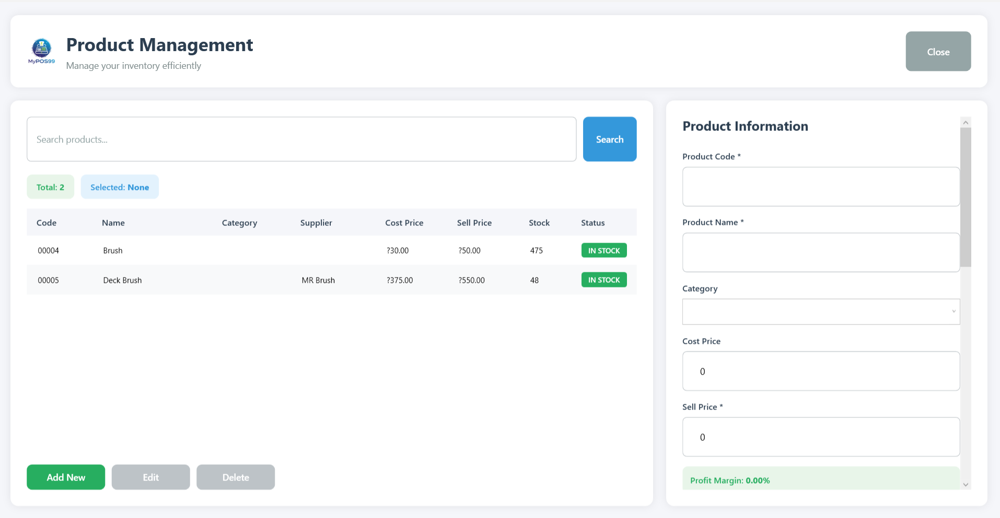
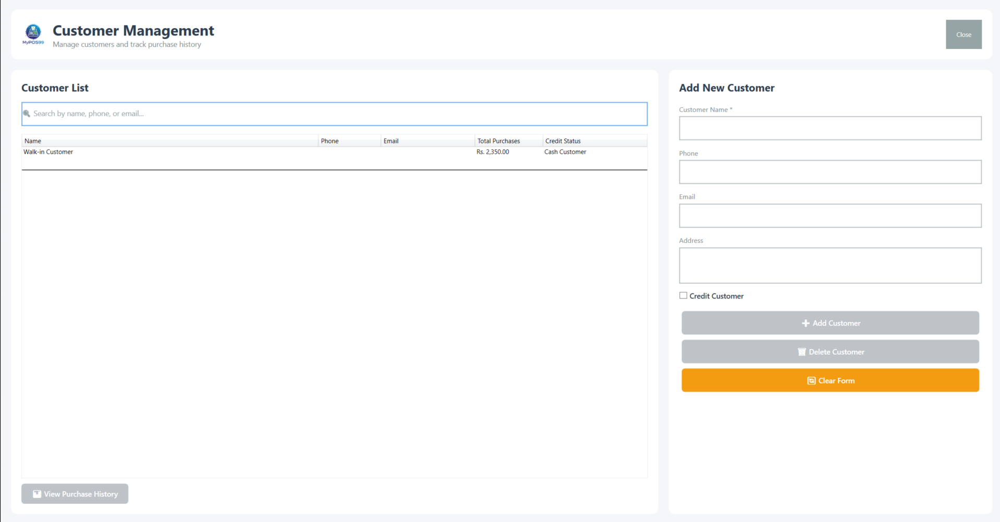
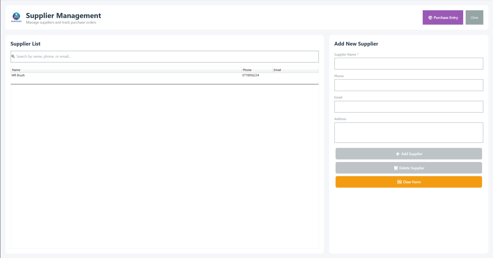
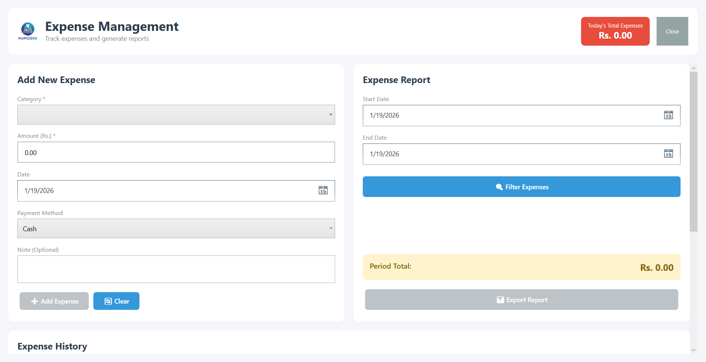
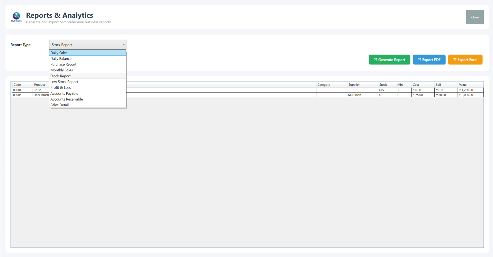

# MyPOS99 - Point of Sale System

A modern WPF-based Point of Sale system built with .NET 10 and SQLite.

## ?? Quick Start

### For End Users
1. **Download** the latest release from [Releases](https://github.com/Geethanjana99/MyPOS99/releases)
2. **Extract** the zip file
3. **Run** `MyPOS99.exe`
4. **Login** with: Username: `admin`, Password: `admin123`
5. **?? Important**: Change the default password after first login!

### For Developers
1. **Clone** the repository:
   ```bash
   git clone https://github.com/Geethanjana99/MyPOS99.git
   cd MyPOS99
   ```

2. **Open** in Visual Studio 2022 or later

3. **Restore** NuGet packages:
   ```bash
   dotnet restore
   ```

4. **Build** the solution:
   ```bash
   dotnet build
   ```
   Or press `Ctrl+Shift+B` in Visual Studio

5. **Run** the application:
   ```bash
   dotnet run
   ```
   Or press `F5` in Visual Studio

6. **Run Tests** (optional):
   ```bash
   cd MyPOS99.Tests
   dotnet test
   ```

## ?? Project Structure

```
MyPOS99/
??? Models/              # Data models and entities
?   ??? User.cs
?   ??? Product.cs
?   ??? Customer.cs
?   ??? Supplier.cs
?   ??? Sale.cs
?   ??? SaleItem.cs
?   ??? Purchase.cs
?   ??? PurchaseItem.cs
?   ??? Expense.cs
?   ??? Category.cs
?
??? Views/               # WPF views (XAML)
?   ??? MainWindow.xaml
?   ??? MainWindow.xaml.cs
?
??? ViewModels/          # MVVM view models
?   ??? ViewModelBase.cs       # Base class with INotifyPropertyChanged
?   ??? MainViewModel.cs
?   ??? RelayCommand.cs        # ICommand implementation
?
??? Services/            # Business logic layer
?   ??? ProductService.cs
?   ??? SaleService.cs
?   ??? UserService.cs
?   ??? ExpenseService.cs
?   ??? CategoryService.cs
?   ??? CustomerService.cs
?   ??? SupplierService.cs
?
??? Data/                # Database layer
?   ??? DatabaseContext.cs          # DatabaseService + connection
?   ??? DATABASE_SCHEMA.md          # Schema documentation
?   ??? DATABASE_SERVICE_GUIDE.md   # Usage guide
?
??? App.xaml            # Application resources and startup
```

## ??? Architecture

This project follows the **MVVM (Model-View-ViewModel)** pattern:

- **Models**: Data entities representing database tables
- **Views**: XAML UI components
- **ViewModels**: Presentation logic with data binding
- **Services**: Business logic and data access
- **Data**: Database operations with parameterized queries

## ?? Database

### Tables
The application uses **SQLite** with the following schema:

| Table | Description |
|-------|-------------|
| **Users** | System users (Admin, Cashier, Manager) |
| **Products** | Product inventory with pricing & stock |
| **Customers** | Customer database with purchase history |
| **Suppliers** | Vendor/supplier information |
| **Sales** | Sales transactions |
| **SaleItems** | Sale line items |
| **Purchases** | Purchase orders from suppliers |
| **PurchaseItems** | Purchase line items |
| **Expenses** | Business expense tracking |
| **Categories** | Product categories |

### DatabaseService Features
- ? Parameterized queries (SQL injection protection)
- ? Transaction support for atomic operations
- ? Async/await for all operations
- ? Generic query execution with mapping
- ? Automatic connection management

**See:** `Data/DATABASE_SERVICE_GUIDE.md` for detailed usage

## ??? Technologies

- **.NET 10** - Latest .NET framework
- **WPF** - Windows Presentation Foundation
- **SQLite** - Embedded database (Microsoft.Data.Sqlite)
- **MVVM Pattern** - Model-View-ViewModel architecture
- **C# 12** - Latest language features
- **BCrypt.Net** - Secure password hashing
- **QuestPDF** - PDF generation
- **EPPlus** - Excel export functionality

## ?? Testing & CI/CD

### Unit Testing
- **Framework**: xUnit with FluentAssertions
- **Mocking**: Moq for dependency injection
- **Coverage**: Services, ViewModels, and Models
- **Run Tests**: `dotnet test` in MyPOS99.Tests directory

### Continuous Integration
- **Platform**: GitHub Actions
- **Automated Builds**: Every push to master/main/develop
- **Automated Testing**: All unit tests run on each commit
- **Release Automation**: Automatic releases on version tags


For detailed testing instructions, see [TESTING.md](TESTING.md)

## ?? Screenshots

### Login Screen
Secure authentication with role-based access control.



### Dashboard
Comprehensive overview with key metrics and quick actions.



### Sales/POS Interface
Intuitive point-of-sale system with cart management and multiple payment options.


### Product Management
Complete inventory management with stock tracking and category organization.



### Customer Management
Customer database with purchase history and contact information.



### Supplier Management
Supplier tracking and relationship management.



### Expense Tracking
Business expense monitoring and categorization.



### Reports & Analytics
Comprehensive reporting system with multiple report types.



### PDF Report Generation
Professional PDF exports for all report types.


## ?? Documentation

- **Database Schema**: See [Data/DATABASE_SCHEMA.md](Data/DATABASE_SCHEMA.md)
- **Service Usage**: See [Data/DATABASE_SERVICE_GUIDE.md](Data/DATABASE_SERVICE_GUIDE.md)
- **API Reference**: XML documentation in code
- **Testing Guide**: See [TESTING.md](TESTING.md)
- **Performance Metrics**: See [PERFORMANCE.md](PERFORMANCE.md)
- **Deployment Guide**: See [DEPLOYMENT.md](DEPLOYMENT.md)

## ? Key Features

### Core Features (Fully Implemented)
- ? **User Authentication & Authorization**
- ? **Dashboard** - Real-time metrics and quick action buttons
- ? **Sales/POS Interface** - Complete point-of-sale system with cart management
- ? **Product Management** - Full CRUD operations with stock tracking
- ? **Inventory Management** - Automatic stock updates and low-stock alerts
- ? **Customer Management** - Customer database with purchase history
- ? **Supplier Management** - Supplier tracking and contact management
- ? **Purchase Orders** - Purchase entry and inventory receiving
- ? **Expense Tracking** - Business expense monitoring and categorization
- ? **Reports & Analytics** - Comprehensive reporting with PDF/Excel export
- ? **Return/Exchange Management** - Sales return and exchange processing
- ? **Multi-Payment Support** - Cash, Card, Mobile, and Credit payment types
- ? **Receipt Generation** - Automated PDF receipt creation

### Technical Implementation
- ? MVVM architecture with ViewModelBase
- ? SQLite database with 10 normalized tables
- ? Secure parameterized queries (SQL injection protection)
- ? Complete service layer (10+ services)
- ? Transaction support for data integrity
- ? Async/await patterns throughout
- ? PDF and Excel export functionality
- ? Custom WPF value converters
- ? Comprehensive data validation
- ? Unit tests with xUnit
- ? CI/CD with GitHub Actions
- ? XML documentation for all public APIs

## ?? Security

- ? BCrypt password hashing implemented
- ? Parameterized SQL queries (SQL injection protection)
- ? Role-based access control (Admin, Cashier, Manager)
- ? Secure session management
- ? Input validation and sanitization

## ?? Usage Example

```csharp
// Initialize services
var dbService = new DatabaseService();
var productService = new ProductService(dbService);

// Add a product
var product = new Product
{
    Code = "P001",
    Name = "Laptop",
    CostPrice = 35000,
    SellPrice = 45000,
    StockQty = 10,
    MinStockLevel = 2
};
await productService.AddProductAsync(product);

// Get all products
var products = await productService.GetAllProductsAsync();

// Search products
var searchResults = await productService.SearchProductsAsync("Laptop");
```

## ??? Development Roadmap

### ? Phase 1 - Completed
- ? Login screen with authentication
- ? Dashboard with real-time metrics
- ? Product management interface
- ? POS/Sales interface with cart system
- ? Customer and Supplier management
- ? Reports and analytics

### ? Phase 2 - Completed
- ? Receipt generation (PDF)
- ? Inventory alerts and low stock notifications
- ? Comprehensive reporting system
- ? Data export (PDF & Excel)
- ? Purchase order management
- ? Expense tracking

### ?? Phase 3 - Future Enhancements
- [ ] Barcode scanner integration
- [ ] Thermal receipt printer support
- [ ] Cloud backup integration
- [ ] Multi-store support
- [ ] Mobile app companion
- [ ] Advanced analytics dashboard
- [ ] Email notifications
- [ ] SMS integration

## ?? Contributing

We welcome contributions! Here's how you can help:

### Ways to Contribute
- ?? Report bugs via [GitHub Issues](https://github.com/Geethanjana99/MyPOS99/issues)
- ?? Suggest new features or enhancements
- ?? Improve documentation
- ?? Add more unit tests
- ?? Enhance UI/UX design
- ?? Fix bugs or implement features

### Development Setup
1. Fork the repository
2. Create a feature branch (`git checkout -b feature/amazing-feature`)
3. Make your changes
4. Write/update tests
5. Commit your changes (`git commit -m 'Add amazing feature'`)
6. Push to the branch (`git push origin feature/amazing-feature`)
7. Open a Pull Request

### Code Standards
- Follow existing code style and conventions
- Add XML documentation for public APIs
- Write unit tests for new features
- Ensure all tests pass before submitting PR
- Update README if adding new features

### Testing Your Changes
```bash
# Run all tests
dotnet test

# Run with coverage
dotnet test --collect:"XPlat Code Coverage"
```

## ?? License

This project is for educational purposes.

## ?? Support

For issues or questions:
1. Check `Data/DATABASE_SERVICE_GUIDE.md` for database operations
2. Review `Data/DATABASE_SCHEMA.md` for schema details
3. See inline code comments for specific implementations

---

**Built with ?? using .NET 10 and WPF**
